# EmailS: 126、163邮箱批量导出

- python version: Python 3.8.10，使用python 3及以上版本
## Usage

1. 在`config.py`中填入需要导出邮件的邮箱账号和密码，以及邮件保存的地址。格式已经给出。如果需要新增，只需要复制这个格式，新增保存文件即可。
2. pip install -r requirements.txt
3. python emails.py -h

```
usage: emails.py [-h] [-ae] [-pe PAGEEXP] [-te TIMEINPUT [TIMEINPUT ...]]

optional arguments:
  -h, --help            show this help message and exit
  -ae, --allExp         Export all emails, 导出用户所有邮件
  -pe PAGEEXP, --pageExp PAGEEXP
                        Export by page number, 根据页码导出, 如只导出前3页, -pe 3
  -te TIMEINPUT [TIMEINPUT ...], --timeExp TIMEINPUT [TIMEINPUT ...]
                        Export by time, 根据邮件时间导出， 如导出2020年12月1日 07:30的邮件 -te 2020-12-1-07-30

用法举例: python .\emails.py -ae
```

## 效果

## 导出全部邮件

```
python .\emails.py -ae
```

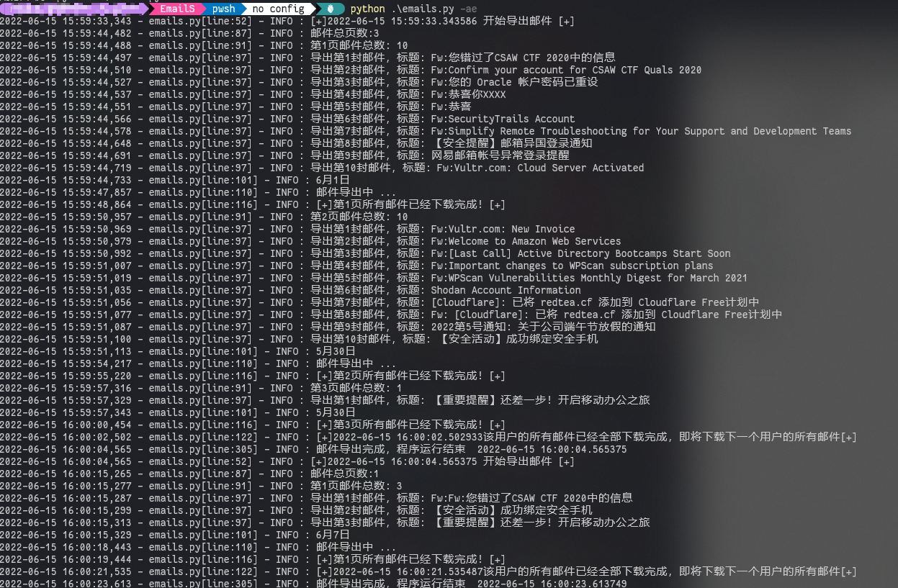

## 按照页数导出

```
 python .\emails.py -pe 1
```

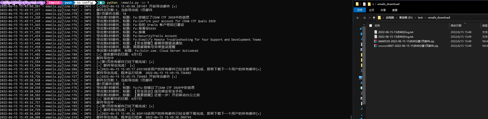

## 按照时间导出

```
python emails.py -te 2022-6-1-10-54
```

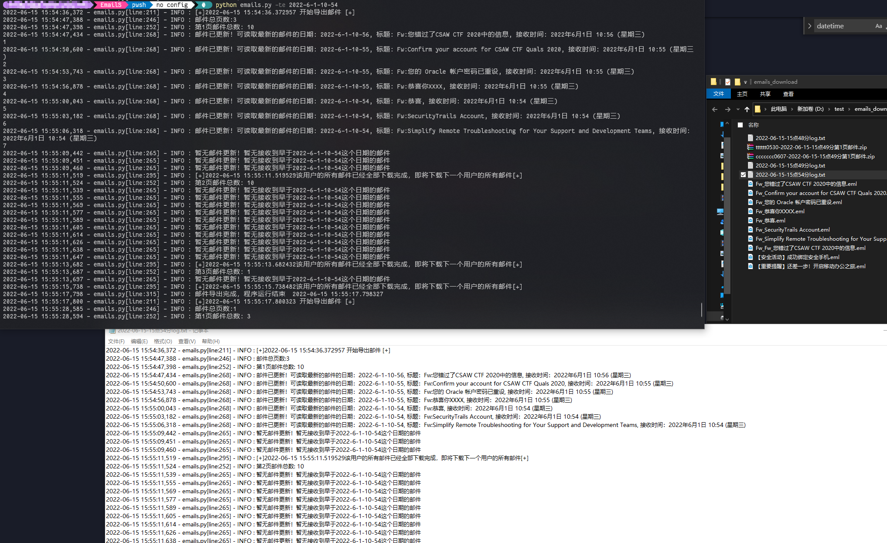

## eml 文件使用
可以直接用Outlook，Foxmail等邮件客户端打开查看邮件内容。
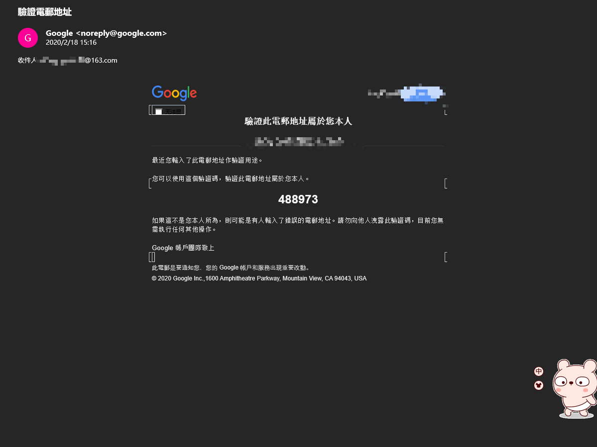
查看附件

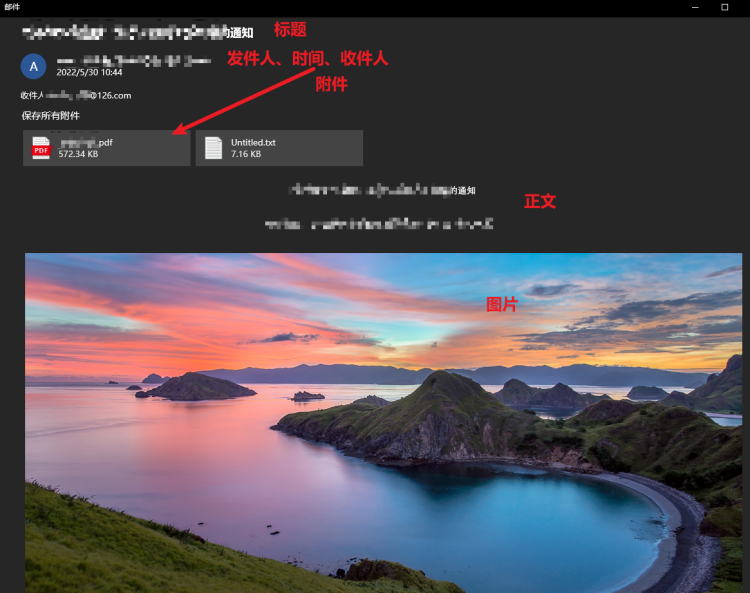


# 配置过程

## selenium 环境搭建

1. 去Google官网下载与本机Google Chrome浏览器版本一致的Chromedriver。

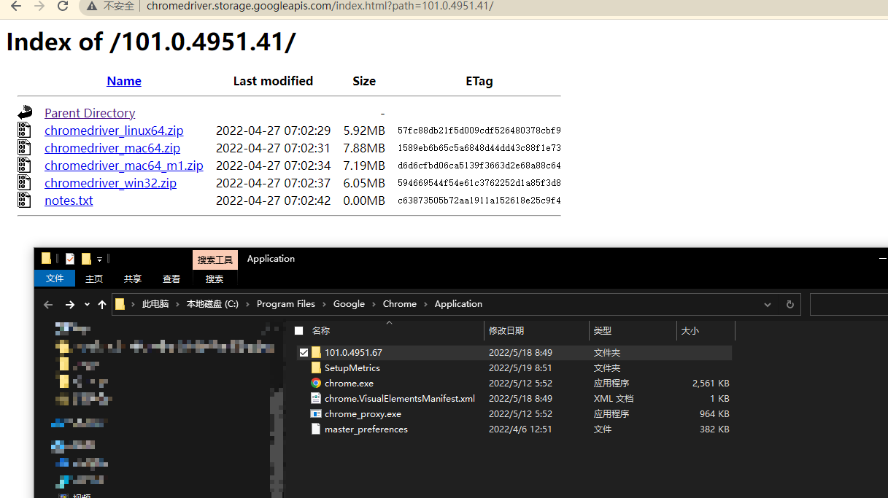

如图为，101.0.4951.41 ，和 101.0.4951.67

2. 将Chromedriver放在python的Scripts目录和Google Chrome的Application目录。

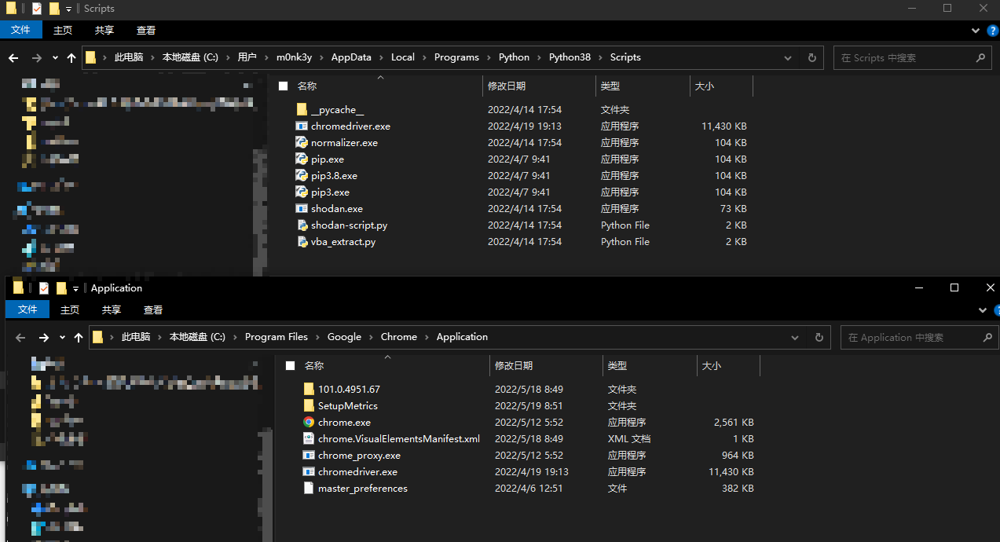

3. 将上面这**两个目录**添加的系统环境变量Path。

`C:\Program Files\Google\Chrome\Application`

`C:\Users\yourusername\AppData\Local\Programs\Python\Python38\Scripts` , 修改`yourusername` 为本地电脑的用户名

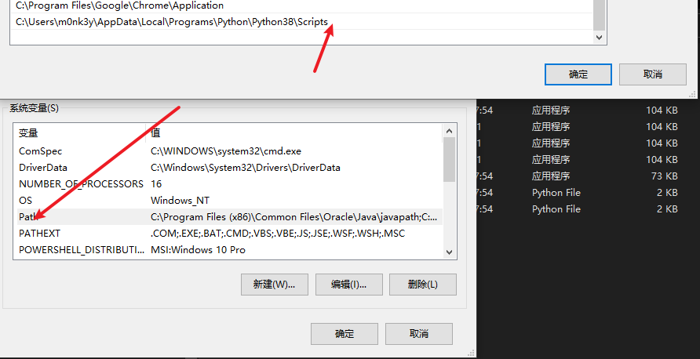

4. 测试是否成功。

demo.py

```python
from selenium import webdriver
browser = webdriver.Chrome()
browser.get('https://www.baidu.com')
```
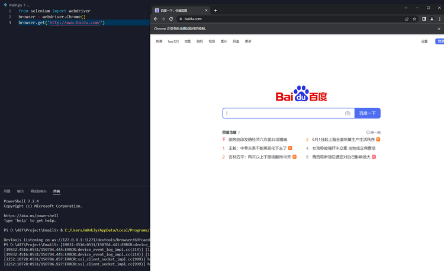

## 添加账号

在`config.py`中的`user_profile`中，填入需要导出邮件的邮箱账号`username`和密码`password`，格式已经给出，如下图所示。

如果需要新增，只需要复制这个格式，新增保存文件即可。

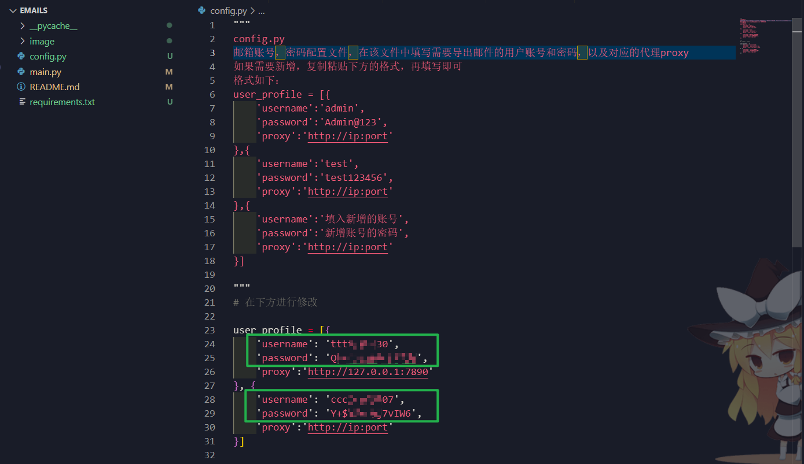

## 设置代理

在`user_profile` 中，设置`proxy`字段，如下图所示：

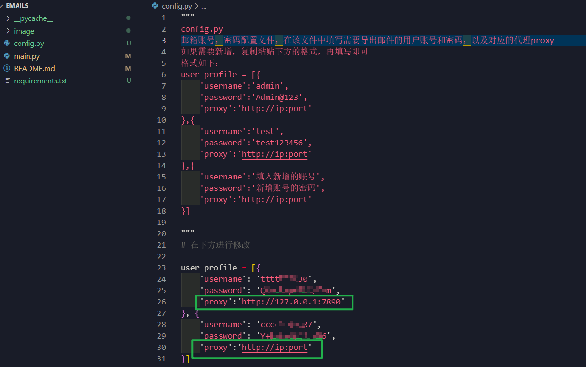

在源码中，将代理相关的代理注释删掉，并将没有proxy的进行注释。(**删掉最左边的#，在原来的最左边添加#**

```
# def allExp(username,password,proxy):
def allExp(username,password):
# option.add_argument('--proxy-server=' + proxy)
# allExp(j['username'],j['password'],j['proxy'])
```

总共有9处需要删掉和注释掉（一个模块中有3处，3个模块共9个）

## 邮件保存路径

在`config.py` 中修改`download_path` 参数，修改为自己想要保存的路径，默认为`D:\test\emails_download`

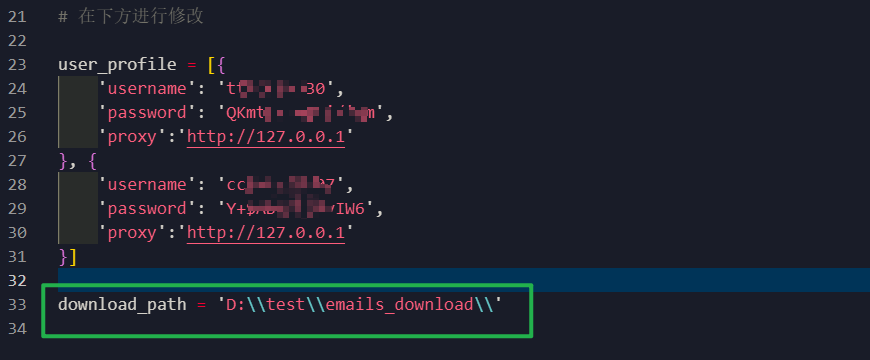

# 注意

1. 异地、异国登录会触发异地告警（可通过代理解决）
2. 登录过于频繁也会触发滑动选择文字识别验证码（短时间内（半个小时）不要超过连续5次运行该工具）
